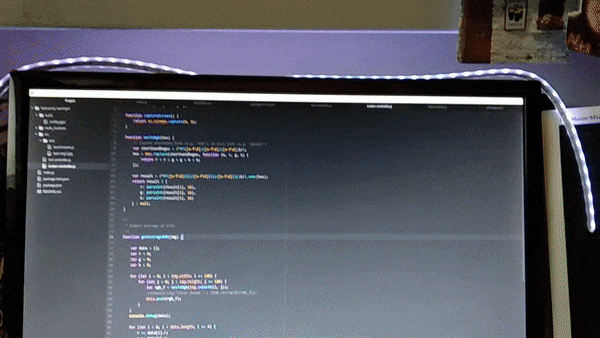

# Backlight Node controller for FadeCandy
This small node application controls your FadeCandy led stripe and continuously check for the current screen dominant color. The main goal is to have a "backlight screen effect", thus representing the main color of the screen with the led stripes.

## Install & Run
Use `npm install`
and a good old
`npm start`.

In order to install **robotjs**, required for checking the screen color, you might need to compile it for your platform, instructions are provided in the official robotjs [documentation](http://robotjs.io/docs/building).

## Notes on contributions
Given time, I will try to make the script more modular and add more features such as:
* Add new tests
* Optimize the color algorithm - right now it's pretty stupid
* Multiple stripes/controller support
* Mobile client/controller
* Sound based effects from the computer

For any suggestion or contribution do not hesitate to contact me.
